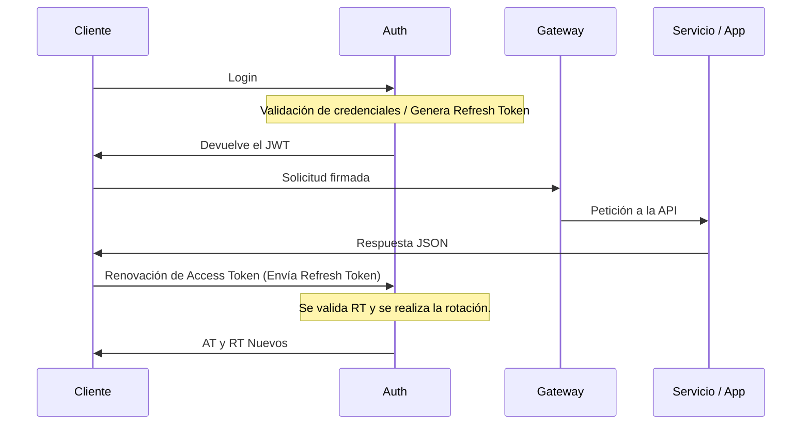

#### Describe el flujo completo de autenticación usando JWT + refresh tokens: ¿dónde se generan, cómo viajan, dónde se validan?


Dependiendo la arquitectura, la validación del JWT se puede realizar mediante el API Gateway (Centralizado) o en el Middleware de cada microservicio (Distribuido).

#### ¿Dónde almacenarías el refresh token y por qué? Menciona las implicaciones de seguridad de cada opción.

#### Cuando el Servicio A necesita llamar internamente al Servicio B, ¿cómo manejas la autenticación? ¿Usas el mismo token del usuario o uno diferente?

El usar el mismo token para cada microservicio puede significar un riesgo en caso de que uno solo sea vulnerado. Para comunicar microservicios para operaciones sensibles se utilizaría Token Exchange para limitar la información entre microservicios únicamente a lo necesario, con la desventaja de aumentar la complejidad del sistema, o en su defecto usar TLS Mutuo con microservicios dentro de la misma capa de red.

#### Identifica la vulnerabilidad en este fragmento y explica cómo la corregirías:
```js
// middleware de verificacion JWT
app.use((req, res, next) => {

  const token = req.headers['authorization'];

  const decoded = jwt.decode(token);   // <-- observa esta linea

  req.user = decoded;

  next();

});
```

JWT decode no realiza la verificación del token con la firma secreta del servidor. Debe usarse `const decoded = jwt.verify(token, secretKey)`

#### ¿Qué estrategia usarías para manejar la expiración de tokens sin forzar al usuario a iniciar sesión cada hora?

El usar Refresh Tokens con una caducidad de 7 a 30 días permite al usuario omitir el login si no ha estado inactivo en ese periodo de tiempo, ya que los Access Tokens que tienen una corta duración se actualizan automáticamente mediante una solicitud desde el Frontend, que a su vez actualiza tambien el Refresh Token.